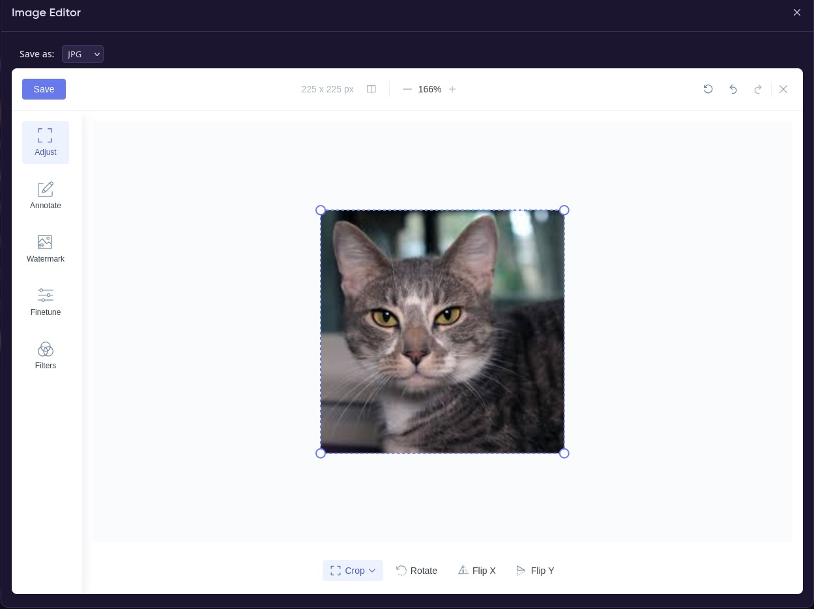

# MoonShine Image Editor



Image editor for [MoonShine](https://moonshine-laravel.com/) admin panel powered by [Filerobot Image Editor](https://github.com/scaleflex/filerobot-image-editor). Integrates with [MoonShine Media Manager](https://github.com/yurizoom/moonshine-media-manager) to provide in-browser image editing with automatic optimization and WebP/AVIF conversion.

## Features

- Full-featured image editor: adjust, annotate, crop, resize, rotate, filters, finetune, watermark
- Format selector (PNG/JPG) in modal toolbar — defaults to original format, separate from editor
- **Automatic optimization on upload** via Media Manager events — images are optimized and converted when uploaded through the file manager
- **Automatic cleanup on delete** — WebP/AVIF conversions are removed when the source image is deleted
- **Admin settings page** — manage optimization quality, conversion toggles, and queue settings directly from MoonShine panel (stored in DB)
- **Batch optimization** — scan and re-process existing images with real-time progress bar, detailed logs (webp vs original, avif vs webp), and file filter
- Optimization with size comparison (keeps smaller version)
- Optional WebP/AVIF conversion with size-aware cleanup
- Queue support for async processing
- Localization support (EN, RU) via Laravel lang files
- No CDN dependencies — all assets are local
- Imagick driver support with automatic fallback to GD
- Integrates as a file action button in Media Manager

## Requirements

- PHP 8.2+
- Laravel 11+ / 12+
- MoonShine 4.x
- `yurizoom/moonshine-media-manager` ^4.0
- `intervention/image-laravel` ^1.0 (installs `intervention/image` ^3.0 automatically)
- PHP Imagick extension (recommended) or GD

## Installation

```bash
composer require povly/moonshine-image-editor
```

### Image Optimization Dependency

For image optimization and format conversion (WebP/AVIF) to work, install Intervention Image:

```bash
composer require intervention/image-laravel
```

> **Note:** Only `intervention/image-laravel` is needed — it automatically installs `intervention/image` as a dependency.

Publish the Intervention Image config (optional):

```bash
php artisan vendor:publish --provider="Intervention\Image\Laravel\ServiceProvider"
```

This creates `config/image.php` where you can set the default driver (GD or Imagick).

Publish assets:

```bash
php artisan vendor:publish --tag=image-editor-assets
```

Optionally publish config and translations:

```bash
php artisan vendor:publish --tag=image-editor-config --tag=image-editor-lang --force
```

Or everything at once:

```bash
php artisan vendor:publish --tag=image-editor-assets --tag=image-editor-config --tag=image-editor-lang --force
```

Run migrations (creates `image_editor_settings` table):

```bash
php artisan migrate
```

## Setup

### 1. Register assets

Add the package JS and CSS to your MoonShine layout's `assets()` method:

```php
use MoonShine\AssetManager\Css;
use MoonShine\AssetManager\Js;

protected function assets(): array
{
    return [
        ...parent::assets(),
        Css::make('/vendor/image-editor/image-editor.css'),
        Js::make('/vendor/image-editor/filerobot-image-editor.min.js'),
        Js::make('/vendor/image-editor/image-editor.js'),
    ];
}
```

### 2. Render the editor modal

Add the modal to your layout's `getContentComponents()` method:

```php
use MoonShine\UI\Components\FlexibleRender;
use Povly\MoonShineImageEditor\ImageEditorServiceProvider;

protected function getContentComponents(): array
{
    return [
        ...parent::getContentComponents(),
        FlexibleRender::make(
            ImageEditorServiceProvider::renderModal(),
        ),
    ];
}
```

The "Edit Image" button automatically appears in the Media Manager for image files. The listeners for upload optimization and delete cleanup are registered automatically — no additional setup required.

### 3. Image driver (recommended)

For best PNG optimization, install the Imagick PHP extension:

```bash
# Arch / CachyOS
sudo pacman -S php-imagick
echo 'extension = imagick' | sudo tee /etc/php/conf.d/imagick.ini

# Ubuntu / Debian
sudo apt install php-imagick
```

The package auto-detects the driver — if Imagick is available it will be used, otherwise GD. You can also configure it explicitly in `config/image.php`:

```php
return [
    'driver' => extension_loaded('imagick')
        ? \Intervention\Image\Drivers\Imagick\Driver::class
        : \Intervention\Image\Drivers\Gd\Driver::class,
];
```

> **Note:** GD cannot optimize PNG effectively — it often makes files larger. Imagick is strongly recommended for PNG support.

## Configuration

Settings can be managed from the **MoonShine admin panel** (recommended) or via the config file. Database settings override config values at runtime.

Publish the config file (optional):

```bash
php artisan vendor:publish --tag=image-editor-config
```

```php
// config/moonshine/image_editor.php
return [
    'available_formats' => ['png', 'jpg'],
    'quality' => ['jpg' => 82],
    'optimize' => [
        'enabled' => true,
        'strip_metadata' => true,
        'max_width' => null,
        'max_height' => null,
    ],
    'convert' => [
        'webp' => ['enabled' => true, 'quality' => 80],
        'avif' => ['enabled' => true, 'quality' => 65],
    ],
    'queue' => [
        'enabled' => false,
        'connection' => null,
        'queue' => 'images',
        'delay' => 60,
    ],
    'default_tabs' => ['Adjust', 'Annotate', 'Watermark', 'Finetune', 'Filters'],
    'default_tab' => null,
    'default_tool' => null,
    'overwrite_original' => false,
    'locale' => null,
    'theme' => [...],
    'watermark_gallery' => [],
];
```

### Config Options

| Option | Default | Description |
|--------|---------|-------------|
| `available_formats` | `['png', 'jpg']` | Formats shown in the save dialog |
| `quality.jpg` | `82` | JPG quality (1–100). PNG is lossless, no quality setting. |
| `optimize.enabled` | `true` | Enable post-save optimization |
| `optimize.strip_metadata` | `true` | Strip EXIF/IPTC metadata |
| `optimize.max_width` | `null` | Max width (keeps aspect ratio) |
| `optimize.max_height` | `null` | Max height (keeps aspect ratio) |
| `convert.webp.enabled` | `true` | Generate WebP version |
| `convert.webp.quality` | `80` | WebP quality (1–100) |
| `convert.avif.enabled` | `true` | Generate AVIF version |
| `convert.avif.quality` | `65` | AVIF quality (1–100) |
| `queue.enabled` | `false` | Offload optimization to queue |
| `queue.delay` | `60` | Delay in seconds before processing |
| `default_tabs` | `['Adjust', ...]` | Visible editor tabs |
| `overwrite_original` | `false` | Overwrite original or save with `-edited` suffix |
| `locale` | `null` | Editor language (`null` = auto-detect) |

## Localization

Translations are loaded from the package automatically. Supported languages:

- `en` — English (default)
- `ru` — Russian

To override translations, publish them:

```bash
php artisan vendor:publish --tag=image-editor-lang
```

Files will be published to `lang/vendor/image-editor/en/` and `lang/vendor/image-editor/ru/`.

## How It Works

### Image Editor

1. User clicks the **"Edit Image"** button in Media Manager
2. A modal opens with the format selector toolbar and Filerobot Image Editor
3. The format selector defaults to the original image format
4. User edits the image (crop, filters, text, etc.)
5. On save, the selected format is used — image is uploaded to the same directory as the original
6. If `overwrite_original` is `false` (default), the file is saved with a `-edited` suffix
7. Post-save: optimization runs, WebP/AVIF generated if enabled
8. **Size comparison**: if optimized/conversion is larger → smaller version is kept

### Automatic Upload Optimization

When a user uploads an image through the Media Manager:

1. `MediaManagerFileUploaded` event fires
2. `OptimizeUploadedImage` listener detects image files (jpg, png, gif, webp, avif)
3. Image is optimized (strip metadata, resize if configured)
4. WebP/AVIF versions generated if enabled
5. Supports queue for async processing

### Automatic Delete Cleanup

When a user deletes an image through the Media Manager:

1. `MediaManagerFileDeleted` event fires
2. `DeleteImageConversions` listener finds associated `.webp` and `.avif` files
3. Conversion files are removed automatically

### Size Comparison Logic

```
Optimized file  ≥ original size?  → keep original
WebP            ≥ original size?  → delete WebP
AVIF            ≥ WebP size?      → delete AVIF
  (or ≥ original if no WebP)
```

### Admin Settings Page

The package adds a **"Image Editor Settings"** page to the MoonShine sidebar with two tabs:

#### Settings Tab

Configure optimization and conversion parameters stored in the database:

- **Quality** — JPG, WebP, AVIF quality (1–100)
- **Conversion** — enable/disable WebP and AVIF generation
- **Optimization** — strip metadata, max width/height
- **Queue** — enable async processing, delay

Settings are applied to the config at runtime on each request, so changes take effect immediately without editing config files.

#### Batch Optimization Tab

Re-process existing images with current settings:

1. Choose filter: **All images** (recreate conversions) or **Only without conversions** (skip files that already have webp/avif)
2. Scan files — shows count of matching originals (jpg/png/gif)
3. Start processing — runs via Laravel `Bus::batch` on the `images` queue
4. Real-time progress bar with processed/total counter
5. Detailed log showing per-file results:
   - Original: `photo.jpg (100 KB → 95 KB, -5%)`
   - WebP conversion: `→ photo.webp (95 KB → 50 KB, -47.4%, vs original)`
   - AVIF conversion: `→ photo.avif (50 KB → 30 KB, -40%, vs webp)`
   - Automatic deletion: `→ photo.webp deleted (larger than original)`

### Queue Worker Setup

For batch processing (and async optimization), run a queue worker:

```bash
php artisan queue:work --queue=images
```

For production, use Supervisor to keep the worker running:

```ini
# /etc/supervisor/conf.d/moonshine-worker.conf
[program:moonshine-worker]
process_name=%(program_name)s_%(process_num)02d
command=php /var/www/moonshine/artisan queue:work --queue=images --sleep=3 --tries=3 --max-time=3600
autostart=true
autorestart=true
stopasgroup=true
killasgroup=true
user=http
numprocs=1
redirect_stderr=true
stdout_logfile=/var/www/moonshine/storage/logs/worker.log
stopwaitsecs=3600
```

### Format Conversion Flow

Filerobot always exports PNG regardless of the user's format choice. The server handles format conversion:

- **PNG → PNG**: re-encode to optimize file size (requires Imagick for effective compression)
- **PNG → JPG**: convert with configurable quality, progressive encoding, metadata stripping
- **JPG → PNG**: convert to lossless format
- **Same format**: optimize only (strip metadata, resize if configured)

## Artisan Commands

| Command | Description |
|---------|-------------|
| `image-editor:optimize {path} --disk=public --queue` | Optimize a single image and generate conversions. Use `--queue` to dispatch async. |
| `image-editor:clear-conversions --disk=public --path= --dry-run` | Remove orphan WebP/AVIF files where the original image no longer exists. Use `--dry-run` to preview. |
| `image-editor:reset-settings` | Reset image editor settings stored in DB back to config defaults. |

```bash
# Optimize a single image
php artisan image-editor:optimize banners/photo.jpg

# Optimize on a specific disk, async
php artisan image-editor:optimize banners/photo.jpg --disk=s3 --queue

# Find orphan conversions in a directory
php artisan image-editor:clear-conversions --path=banners --dry-run

# Delete all orphan conversions
php artisan image-editor:clear-conversions

# Reset settings to defaults
php artisan image-editor:reset-settings
```

## Security

All controller endpoints are protected by MoonShine auth middleware. Additionally:

- **Settings whitelist** — only predefined keys are accepted (`quality`, `convert`, `optimize`, `queue`), unknown keys are silently ignored
- **Path traversal protection** — `../` and url-encoded variants are rejected in source paths
- **File type validation** — only image extensions (`jpg`, `jpeg`, `png`, `gif`, `webp`, `avif`) are processed
- **Batch limit** — max 500 files per batch operation
- **Settings validation** — quality values clamped to 1–100, dimensions capped at 10000px, types enforced

## Publishing

| Tag | Description |
|-----|-------------|
| `image-editor-assets` | JS and CSS files to `public/vendor/image-editor/` |
| `image-editor-config` | Config to `config/moonshine/image_editor.php` |
| `image-editor-lang` | Translations to `lang/vendor/image-editor/` |

## License

MIT

---

## Related

This package uses [Intervention Image](https://image.intervention.io/) for server-side image processing (optimization, format conversion, WebP/AVIF generation).
